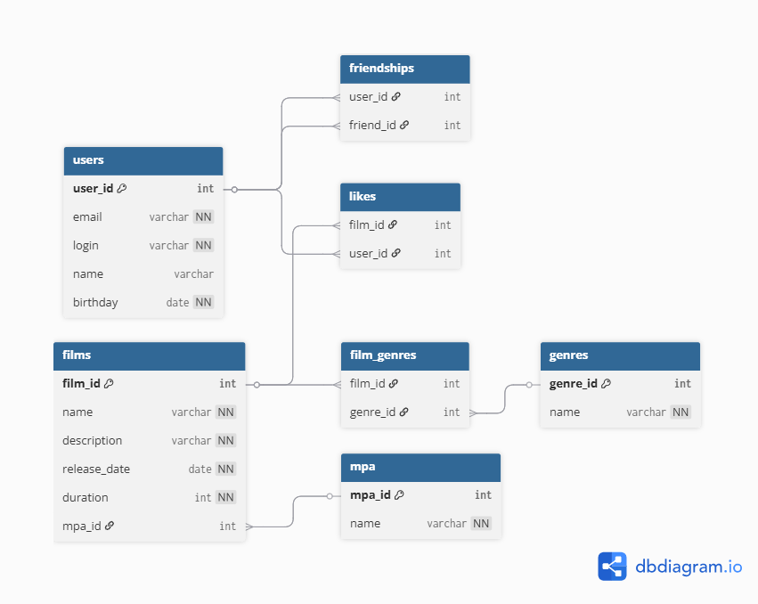

# java-filmorate
Template repository for Filmorate project.

Пояснение к схемЕ:

Пользователи: Хранятся данные о пользователях. Включают email, логин, имя и дату рождения.

Фильмы: Содержат информацию о фильмах, включая название, описание, дату выпуска, продолжительность и рейтинг MPA.

Дружбы: Хранят данные о дружбе между пользователями, с указанием статуса дружбы.

Оценки: Эта таблица связывает пользователей с фильмами, отражая, какие фильмы были оценены.

Жанры: Таблица для хранения жанров фильмов.

Жанры фильмов: Связывает фильмы с их жанрами.

Рейтинг MPA: Описание рейтингов фильмов по возрастным ограничениям.

ПРимеры основных запросов

Получение все фильмы:
SELECT f.name, f.description, f.release_date
FROM films f
JOIN likes l ON f.film_id = l.film_id
WHERE l.user_id = 1;

Получение всех друзей:
SELECT u.name, u.email, f.status
FROM users u
JOIN friendships f ON u.user_id = f.friend_id
WHERE f.user_id = 1;

Получение всех жанров фильма:
SELECT g.name
FROM genres g
JOIN film_genres fg ON g.genre_id = fg.genre_id
WHERE fg.film_id = 1;

Получение всех фильмов к одному жанру:
SELECT f.name
FROM films f
JOIN film_genres fg ON f.film_id = fg.film_id
JOIN genres g ON fg.genre_id = g.genre_id
WHERE g.name = 'Боевик';
